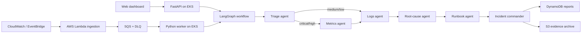

# Architecture

## Runtime flow

## Safety boundary

The application is investigation-only. Recommendations are plans, not commands. Every report sets `requires_human_approval=true`; no node has credentials to mutate workloads. Production remediation should be a separate, tightly scoped workflow with identity, policy checks, dry-run output, and explicit approval.

## Local versus AWS

Local mode invokes the graph synchronously and can use deterministic analysis without credentials. AWS mode uses Lambda and SQS for event ingestion, EKS for the API/worker, DynamoDB for current reports, S3 for durable report archives, and ECR for the image.
